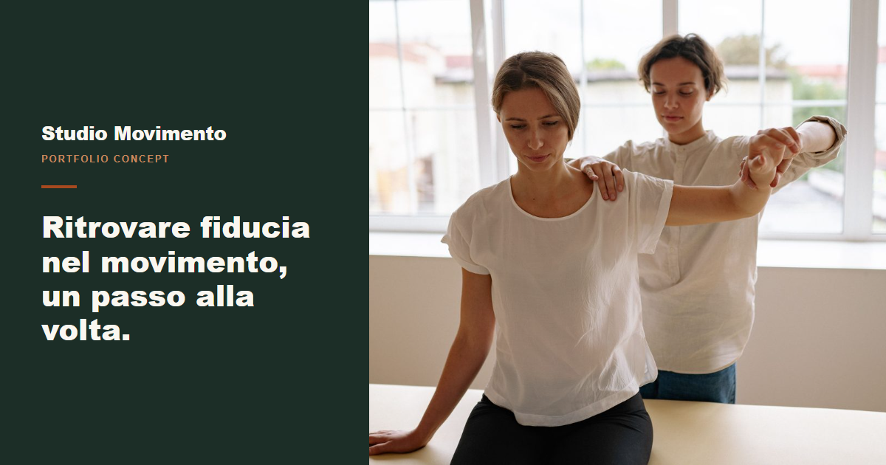
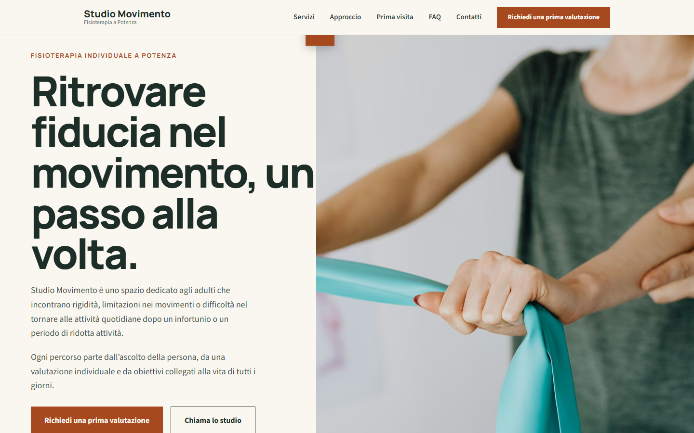
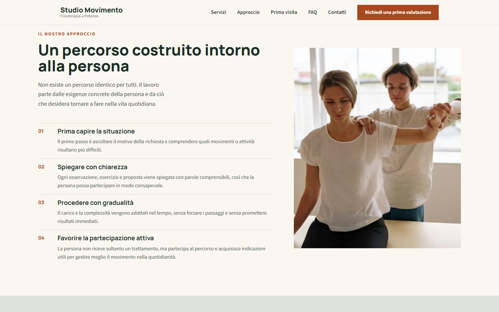
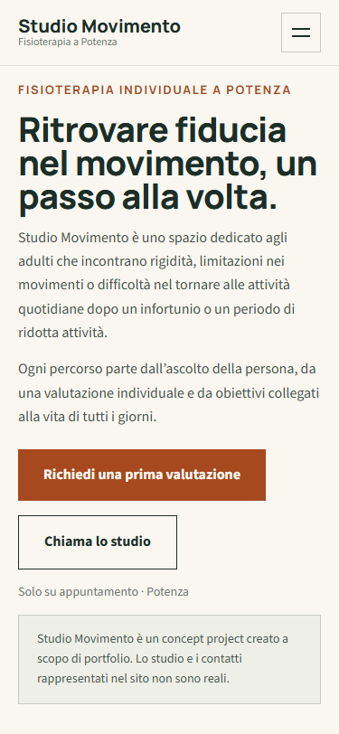

# Studio Movimento

A responsive marketing website concept for an individual physiotherapy practice in Potenza, Italy.

**Personal portfolio concept — not a real clinic or healthcare provider.**



[View live website](https://gorodeikin.github.io/studio-movimento/) · [View source code](https://github.com/Gorodeikin/studio-movimento)

## Project overview

Studio Movimento is a responsive portfolio concept built to explore how a small, independent healthcare practice might present itself online. The site imagines an individual physiotherapy practice based in Potenza, Italy, and is designed around the kind of questions a prospective patient would actually have: what the practice does, what a first meeting looks like, and how to get in touch.

The page presents the studio's services, its approach to treatment, a first-visit walkthrough, practical information, and a set of frequently asked questions, all written in Italian to match the fictional practice's real-world audience. Studio Movimento does not represent any real medical organization, and none of the content, imagery, or contact details should be treated as belonging to an actual clinic or practitioner.

## My role

Project direction, frontend development, responsive implementation, quality assurance, and deployment.

## Technology stack

- HTML5
- CSS3
- JavaScript ES6+
- Git and GitHub
- GitHub Pages
- Responsive images
- AVIF, WebP and JPEG fallbacks
- Locally hosted variable fonts

## Project goals

- Communicate the studio's services clearly.
- Explain what visitors can expect before making contact.
- Reduce uncertainty around the first appointment.
- Provide an accessible, responsive experience across devices.
- Demonstrate a contact-form interaction without transmitting data.

## Key features

- Responsive mobile navigation.
- Editorial hero composition.
- Services section.
- Approach section.
- Fictional specialist presentation.
- First-visit process.
- Practical information.
- Semantic FAQ built with native `<details>` elements.
- Demonstration contact form with validation.
- Separate privacy page.
- Locally hosted fonts.
- Responsive AVIF, WebP and JPEG images.
- Canonical metadata.
- Open Graph metadata.
- Twitter metadata.
- Social sharing preview.

## Visual direction

The design pairs a dark forest green with a warm limestone background and terracotta accents, aiming for a calm, editorial feel rather than a clinical one. Desktop layouts use asymmetric compositions to keep the page visually interesting, while typography stays restrained so the movement and physiotherapy photography can carry the mood.



## Responsive implementation

The interface doesn't just shrink on smaller screens — it restructures. Mobile navigation becomes a toggle-driven panel instead of a horizontal menu, multi-column layouts collapse into vertical flows, and image and text order changes where it improves reading flow. Spacing and component sizes adapt across breakpoints, and every control remains comfortably usable on narrow screens.



<p align="center">
  
</p>

## Accessibility and interaction

The site includes semantic HTML, a skip link, keyboard-accessible navigation, and visible focus states throughout. Form controls are labelled, and error and status messages are written to be accessible to assistive technology. Reduced-motion preferences are respected, the FAQ uses native semantic disclosure elements, and the contact form is a demonstration only — it does not submit or store any data.

Accessibility was considered throughout the implementation and verified through keyboard, responsive, and browser-based checks.

## Technical decisions

A vanilla HTML, CSS, and JavaScript stack was chosen because it suits a small marketing site without introducing unnecessary complexity — the project has no runtime dependencies. Fonts are hosted locally rather than loaded from a third party, and images use responsive sources with modern format fallbacks. Components were built with a pixel-first approach before generalizing to fluid spacing. The site is published through GitHub Pages, the privacy page is kept separate from the main page, and canonical, Open Graph, and Twitter metadata were added to support sharing and search indexing.

## Quality assurance

- Mobile and desktop viewport reviews.
- Horizontal overflow checks.
- Keyboard navigation.
- Mobile menu behavior.
- FAQ behavior.
- Complete form-validation flow.
- Console error checks.
- Broken asset and HTTP checks.
- Published GitHub Pages verification.

## Run locally

1. Clone the repository.
2. Open the project directory.
3. Serve the directory with a local static server.

```
python -m http.server 8000
```

Then open `http://localhost:8000` in a browser.

## Project status

The project is completed, deployed to GitHub Pages, and maintained as a portfolio concept.

## Disclaimer

Studio Movimento is a fictional portfolio concept and does not represent a real clinic, physiotherapist, or healthcare provider. The displayed contact details are demonstrative, and the contact form does not transmit or store submitted data.
